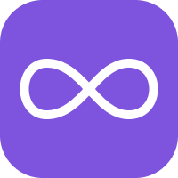
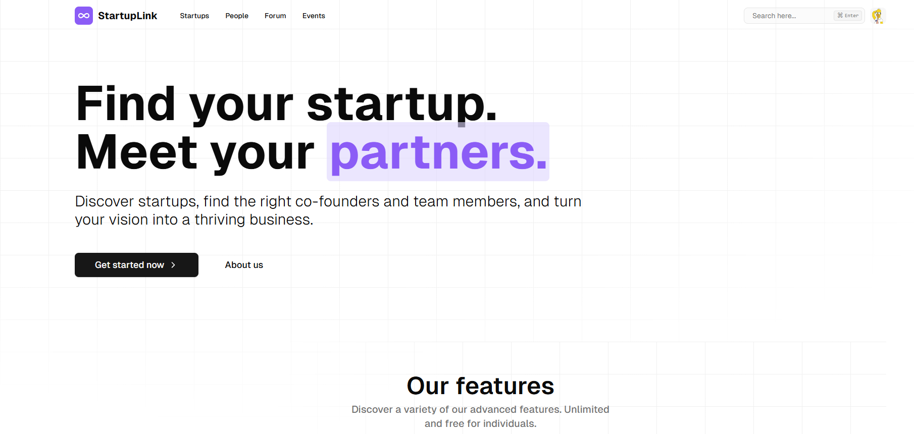

  
  
  
   &nbsp;
  

 
 

  

  <h1 align="center">StartupLink</h3>
  
Find your ideal startup or co-founder. Connect through events and forums designed to help entrepreneurs and innovators build the right team and launch successful ventures. Try it out below...

  

     
    <a href="https://startuplink.vercel.app/">View Demo</a> 
    &middot;
    <a href="https://startuplink.vercel.app/">Report Bug</a>
    &middot;
    <a href="mailto:juanillaberia2002@gmail.com">Contact us</a>
  

## About The Project

There are many great networking platforms out there, but none truly focus on **startups** the way they should.  
That’s why I built this—an **enhanced** platform designed for **founders, builders, and innovators**  
who want to connect, collaborate, and launch startups faster.  

 

## Why This Platform?  

🔥 **Find co-founders** who share your vision and skills  
🌎 **Join a startup** that matches your passion and expertise  
📅 **Discover startup events** and meet like-minded entrepreneurs  
⚡ **Get started faster**—stop waiting and start building today  

 

## 🚀 Get Started  

1️⃣ **Sign up** and create your founder profile  
2️⃣ **Match with co-founders, teams, and startups** based on skills & goals  
3️⃣ **Join startup events & hackathons** to connect with other builders  
4️⃣ **Build, launch, and grow your startup with like-minded innovators**  

> **💡 This isn’t just another networking site—it’s the ultimate startup playground.**  

 

## 📌 Features  

✅ **Startup Matching** – Find & connect with co-founders  
✅ **Startup Marketplace** – Join or list your startup  
✅ **Events & Hackathons** – Stay in the loop with startup activities  
✅ **Founder Profiles** – Showcase your experience, ideas & skills  
✅ **Faster Networking** – No noise, just meaningful startup connections  

 

## 🛠 Built With  

  
  
  
  
  

